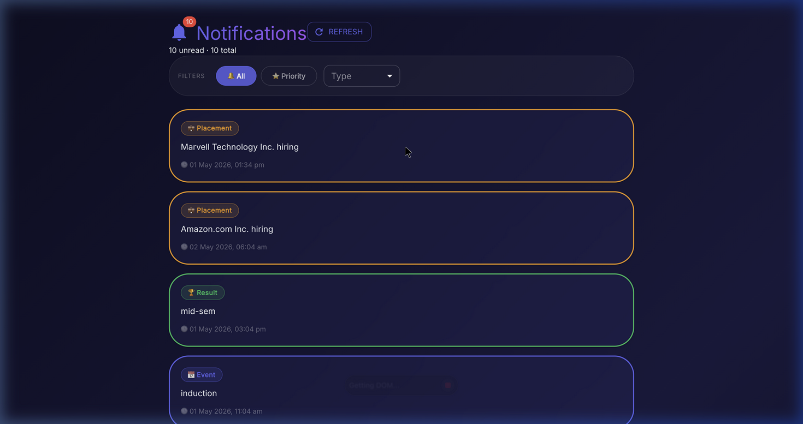
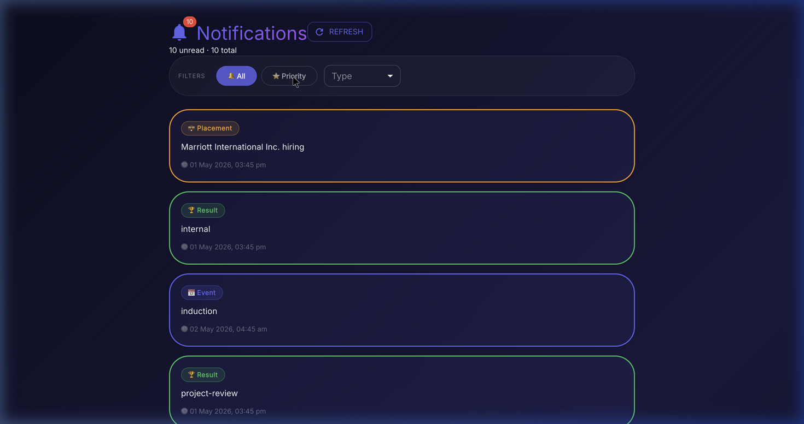

# Notification App — Affordmed Campus Hiring Evaluation

A production-ready notification management dashboard built with React + Vite + TypeScript + Material UI.

## Screenshots

### All Notifications


### Priority View (Top N sorted by timestamp)


### Read State (click card to mark as read)


---

## Repository Structure

```
root/
├── logging_middleware/
│   ├── logger.js              ← Logging middleware (Node.js)
│   ├── logger.ts              ← Logging middleware (TypeScript)
│   └── test.js                ← Standalone test script
├── notification_app_fe/
│   ├── src/
│   │   ├── types.ts           ← Shared interfaces
│   │   ├── logger.ts          ← Frontend logger (Vite proxy)
│   │   ├── App.tsx            ← Root component, auth init
│   │   ├── services/
│   │   │   ├── authService.ts         ← Token fetch + auto-refresh
│   │   │   └── notificationService.ts ← Fetch + sort algorithm
│   │   ├── context/
│   │   │   └── NotificationContext.tsx ← Global state
│   │   ├── components/
│   │   │   ├── NotificationCard.tsx
│   │   │   ├── FilterBar.tsx
│   │   │   └── PaginationBar.tsx
│   │   └── pages/
│   │       └── NotificationList.tsx
│   └── vite.config.ts         ← Port 3000 + API proxy
├── notification_app_be/
│   └── README.md
├── notification_system_design.md
└── README.md
```

---

## Quick Start

```bash
cd notification_app_fe
npm install
npm run dev
```

App runs at **http://localhost:3000**

---

## Features

| Feature | Details |
|---|---|
| Notification List | Fetches from evaluation API, displays Message, Type, Timestamp |
| Type Filter | Filter by Event / Result / Placement |
| All / Priority Toggle | Priority view sorts by timestamp DESC, returns Top N |
| Pagination | URL query params `?page=1&limit=10` |
| Read / Unread | Click card to mark as read, visual state change |
| Auto Auth | Token fetched on startup, refreshed every 12 min |
| Logging | Every action logs via `Log(stack, level, package, message)` |
| CORS Fix | Vite proxy routes `/eval-api/*` to evaluation server |

---

## Tech Stack

- **React 19** + **Vite 8** + **TypeScript**
- **Material UI v9**
- **React Router v6**
- Evaluation API: `http://20.207.122.201/evaluation-service`

---

## Commit Structure

| Commit | Contents |
|---|---|
| `stage 1` | Logging middleware, types, auth service, notification service + algorithm |
| `stage 2` | React UI — components, pages, context, App, Vite config |
